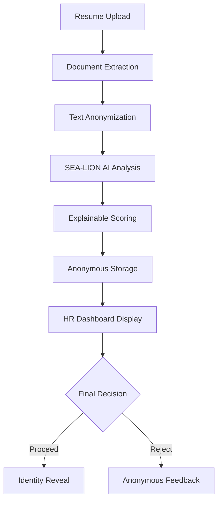

# 🎯 Kampu-Hire: AI-Powered Bias-Free Hiring Platform

[](https://opensource.org/licenses/MIT)
[](https://www.python.org/downloads/)
[](https://fastapi.tiangolo.com/)
[](https://api.sea-lion.ai/)

**Kampu-Hire** is an open-source, AI-powered hiring platform designed to eliminate bias, ensure transparency, and accelerate recruitment processes. Built with Southeast Asian contexts in mind, it provides explainable AI evaluations while protecting candidate privacy through advanced anonymization techniques.

---

## 🚨 The Problem: Bias in Traditional Hiring

### Human Bias Challenges
Traditional hiring processes are plagued by unconscious biases that affect decision-making:

- **📍 Geographic Bias**: Discrimination based on location, address, or regional background
- **🎓 Educational Prestige Bias**: Overvaluing degrees from "elite" institutions
- **👤 Name & Gender Bias**: Unconscious preferences based on names suggesting gender, ethnicity, or religion
- **🏢 Company Brand Bias**: Favoring candidates from well-known companies regardless of individual merit
- **⏰ Age Bias**: Discrimination against younger or older candidates
- **🗣️ Language Bias**: Penalizing non-native speakers despite job relevance

### Algorithmic Bias Problems
Existing AI hiring systems often amplify human biases:

- **💾 Training Data Bias**: Models trained on historically biased hiring decisions
- **🔍 Feature Bias**: Algorithms that use proxy variables for protected characteristics
- **⚫ Black-Box Decisions**: Unexplainable AI systems that can't justify their choices
- **📊 Feedback Loop Bias**: Systems that reinforce existing organizational biases

### Inefficiency Issues
Current hiring processes are slow and resource-intensive:

- **⏳ Manual Screening**: HR teams spend hours reading resumes
- **🔄 Inconsistent Evaluation**: Different reviewers apply different standards
- **📈 Scalability Problems**: Unable to handle large volumes of applications
- **🎯 Poor Candidate Matching**: Missing qualified candidates due to keyword-only searches

---

## 💡 Our Solution: Kampu-Hire

### 🛡️ Bias Elimination Through Anonymization
Kampu-Hire removes bias-inducing information while preserving job-relevant qualifications:

- **🎭 Identity Anonymization**: All candidates are assigned anonymous IDs (e.g., `CAND_AE1D6B07`)
- **📧 Contact Removal**: Automatic detection and removal of emails, phone numbers, addresses
- **🏷️ Name Masking**: Intelligent replacement of names with generic tokens using regional databases
- **🎓 Institution Neutralization**: Focus on degree level and field rather than university prestige
- **🏢 Company Anonymization**: Emphasis on role responsibilities rather than company brands

### 🔍 Transparent AI Evaluation
Our explainable AI system provides detailed reasoning:

- **🧠 SHAP-like Analysis**: Feature importance scores showing what factors influenced decisions
- **📊 Component Breakdown**: Separate scores for skills, experience, education, and culture fit
- **📝 Detailed Reasoning**: Natural language explanations for every decision
- **⚖️ Weighted Scoring**: Customizable criteria weights based on job requirements
- **📈 Confidence Levels**: Transparency about AI certainty in evaluations

### ⚡ Fast & Efficient Processing
Automated screening with human oversight:

- **🚀 SEA-LION AI Integration**: Advanced language models optimized for Southeast Asian contexts
- **📋 Bulk Processing**: Handle hundreds of applications simultaneously
- **🎯 Smart Matching**: Multi-dimensional skill and experience matching
- **📊 Real-time Analytics**: Instant insights into candidate pools and hiring metrics

### 🔐 Privacy-First Design
Protecting candidate privacy throughout the process:

- **🎭 Anonymous-First**: Evaluations completed before identity reveal
- **🔒 GDPR Compliant**: Secure data handling and storage
- **⚠️ Bias Warnings**: System alerts when attempting to reveal identities
- **🗂️ Audit Trails**: Complete transparency in decision-making processes

---

## 🏗️ Technical Architecture

### 🔧 System Overview
```
┌─────────────────┐    ┌─────────────────┐    ┌─────────────────┐
│   Web Frontend  │───▶│  FastAPI Backend │───▶│   AI Services   │
│   (HTML/JS)     │    │   (Python)      │    │  (SEA-LION)     │
└─────────────────┘    └─────────────────┘    └─────────────────┘
         │                       │                       │
         ▼                       ▼                       ▼
┌─────────────────┐    ┌─────────────────┐    ┌─────────────────┐
│  Static Assets  │    │   CSV Storage   │    │ Anonymization   │
│   (CSS/Images)  │    │ (Jobs/Apps)     │    │   Services      │
└─────────────────┘    └─────────────────┘    └─────────────────┘
```

### 📚 Core Components

#### 🧠 AI Evaluation Engine (`explainable_ai_evaluator.py`)
- **SEA-LION Integration**: Leverages state-of-the-art language models
- **Explainable Scoring**: Provides detailed reasoning and feature importance
- **Multi-criteria Analysis**: Skills, experience, education, and culture fit assessment
- **Confidence Scoring**: Measures AI certainty in evaluations

#### 🎭 Anonymization System (`text_utils.py`)
- **Name Detection**: Regional name databases (Khmer, ASEAN, Global)
- **Contact Scrubbing**: Email, phone, and address removal
- **Pattern Matching**: Advanced regex for bias-inducing information
- **Context Preservation**: Maintains job-relevant information

#### 📄 Document Processing (`pdf_extractor.py`)
- **Multi-format Support**: PDF, DOCX, TXT file processing
- **OCR Integration**: Scanned document text extraction
- **Content Cleaning**: Removes formatting artifacts and noise
- **Section Analysis**: Intelligent parsing of resume sections

#### 💼 Job Management (`simple_job_manager.py`)
- **CSV-based Storage**: Simple, portable data management
- **Anonymous Tracking**: Candidate ID generation and management
- **Evaluation Integration**: Seamless AI assessment workflow
- **Analytics Support**: Hiring metrics and insights

#### 🌐 Web Interface (`web.py`)
- **HR Portal**: Comprehensive dashboard for hiring managers
- **Candidate View**: Anonymous candidate profiles and evaluations
- **Application Portal**: Public job application interface
- **Real-time Updates**: Live candidate evaluation status

### 🔄 Evaluation Workflow



### 🛠️ Technology Stack

**Backend Framework:**
- **FastAPI**: High-performance, modern Python web framework
- **Uvicorn**: ASGI server for production deployment
- **Pydantic**: Data validation and settings management

**AI & ML:**
- **SEA-LION AI**: Southeast Asian language-optimized models
- **Transformers**: Hugging Face transformer library
- **SHAP**: Explainable AI for feature importance

**Data Processing:**
- **PyMuPDF**: PDF text extraction
- **python-docx**: Microsoft Word document processing
- **pandas**: Data manipulation and analysis
- **PyYAML**: Configuration file management

**Frontend:**
- **HTML5/CSS3**: Modern web standards
- **Vanilla JavaScript**: No framework dependencies
- **Responsive Design**: Mobile-first approach

---

## 🚀 Quick Start

### 📋 Prerequisites
- Python 3.8 or higher
- Git
- SEA-LION API key (free tier available)

### 🔧 Installation

1. **Clone the Repository**
```bash
git clone https://github.com/SirOsborn/Kampu-Hire.git
cd Kampu-Hire
```

2. **Create Virtual Environment**
```bash
python -m venv venv

# Windows
venv\Scripts\activate

# macOS/Linux
source venv/bin/activate
```

3. **Install Dependencies**
```bash
pip install -r requirements.txt
```

4. **Environment Configuration**
```bash
# Copy environment template
cp .env.example .env

# Edit .env with your settings
# Add your SEA-LION API key
SEA_LION_API_KEY=your_api_key_here
```

5. **Run the Application**
```bash
python -m uvicorn app.main:app --reload --port 8000
```

6. **Access the Platform**
- **HR Portal**: http://localhost:8000/
- **Job Applications**: http://localhost:8000/apply
- **API Documentation**: http://localhost:8000/docs

### 🌐 Environment Variables

```bash
# SEA-LION AI Configuration
SEA_LION_API_KEY=sk-your-api-key
SEA_LION_MODEL=aisingapore/Gemma-SEA-LION-v4-27B-IT
SEA_LION_BASE_URL=https://api.sea-lion.ai/v1
LLM_PROVIDER=sea-lion

# Performance Settings
MAX_TOKENS=2000
RATE_LIMIT_DELAY=1

# Application Settings
BRAND=Kampu-Hire
```

---

## 📁 Project Structure

```
Kampu-Hire/
├── 📁 app/                          # Main application
│   ├── 📁 core/                     # Core configuration
│   │   └── 📄 config.py             # Settings management
│   ├── 📁 data/                     # Data files
│   │   ├── 📄 roles.yaml            # Job role skill definitions
│   │   └── 📁 names/                # Regional name databases
│   ├── 📁 routers/                  # API routes
│   │   └── 📄 web.py                # Web interface routes
│   ├── 📁 services/                 # Business logic
│   │   ├── 📄 explainable_ai_evaluator.py  # Main AI evaluation
│   │   ├── 📄 sealion_skill_extractor.py   # SEA-LION integration
│   │   ├── 📄 simple_job_manager.py        # Job/application management
│   │   ├── 📄 text_utils.py                # Anonymization utilities
│   │   └── 📄 pdf_extractor.py             # Document processing
│   ├── 📁 static/                   # Static web assets
│   ├── 📁 templates/                # HTML templates
│   │   └── 📄 apply.html            # Job application form
│   └── 📄 main.py                   # FastAPI application entry
├── 📁 data/                         # Application data
│   ├── 📄 jobs.csv                  # Job postings
│   └── 📄 applications.csv          # Candidate applications
├── 📁 uploads/                      # Resume file storage
├── 📄 requirements.txt              # Python dependencies
├── 📄 .env                          # Environment configuration
└── 📄 README.md                     # This file
```

---

## ✨ Key Features

### 🎯 For HR Managers
- **📊 Comprehensive Dashboard**: Real-time hiring analytics and candidate overviews
- **🎭 Anonymous Evaluation**: Review candidates without bias-inducing information
- **🔍 Explainable AI**: Understand exactly why AI recommended each candidate
- **📈 Custom Scoring**: Adjust evaluation criteria weights for different roles
- **📋 Bulk Processing**: Handle large application volumes efficiently
- **🗂️ Export Capabilities**: Download hiring data for further analysis

### 🏢 For Organizations
- **⚖️ Legal Compliance**: Reduce discrimination lawsuits through bias elimination
- **🚀 Faster Hiring**: Accelerate time-to-hire with automated screening
- **💰 Cost Reduction**: Minimize manual screening resource requirements
- **📊 Data-Driven Decisions**: Make hiring choices based on objective criteria
- **🔄 Process Standardization**: Consistent evaluation across all roles and teams
- **🌍 Global Scalability**: Support for multiple languages and cultural contexts

### 👨‍💼 For Candidates
- **🎭 Fair Evaluation**: Assessed purely on merit and job-relevant qualifications
- **🔒 Privacy Protection**: Personal information secured throughout the process
- **⚡ Fast Feedback**: Receive evaluation results quickly
- **🌍 Equal Opportunity**: Level playing field regardless of background
- **📋 Transparent Process**: Understand how evaluation decisions are made

### 🛠️ For Developers
- **🔓 Open Source**: MIT license for free use and modification
- **📚 Well-Documented**: Comprehensive API documentation and code comments
- **🔧 Modular Design**: Easy to extend and customize for specific needs
- **🧪 Test Coverage**: Robust testing suite for reliability
- **🌐 API-First**: RESTful APIs for easy integration with existing systems

---

## 🌟 Advanced Features

### 🧠 Explainable AI Evaluation
Our AI evaluation system provides unprecedented transparency:

```python
# Example evaluation output
{
    "overall_score": 0.78,
    "recommendation": "interview",
    "feature_importance": {
        "skills_impact": 0.45,      # 45% weight
        "experience_impact": 0.30,   # 30% weight
        "education_impact": 0.15,    # 15% weight
        "culture_impact": 0.10       # 10% weight
    },
    "component_analysis": {
        "skills": {
            "score": 0.85,
            "relevant_skills": ["Python", "Machine Learning", "SQL"],
            "missing_skills": ["Docker", "Kubernetes"]
        },
        "experience": {
            "score": 0.75,
            "years": 3.5,
            "relevance": "Strong match for mid-level position"
        }
    },
    "reasoning": "Candidate demonstrates strong technical skills...",
    "confidence_level": 0.92
}
```

### 🎭 Advanced Anonymization
Multi-layer anonymization for bias elimination:

- **Regional Name Detection**: Supports Khmer, Southeast Asian, and global names
- **Institution Anonymization**: Replaces university names with degree levels
- **Location Scrubbing**: Removes geographic bias indicators
- **Company Neutralization**: Focuses on role responsibilities over brand names
- **Language Normalization**: Handles multiple languages and writing systems

### 📊 Comprehensive Analytics
Real-time insights into hiring processes:

- **Bias Detection**: Alerts for potential discriminatory patterns
- **Diversity Metrics**: Track hiring diversity across dimensions
- **Performance Analytics**: Measure screening accuracy and efficiency
- **Candidate Journey**: Track application flow and conversion rates
- **ROI Calculation**: Quantify hiring process improvements

---

## 🔮 Future Roadmap

### 🎯 Short-term Goals (3-6 months)
- **🌏 Multi-language Support**: Expand to Vietnamese, Thai, Indonesian, Tagalog
- **📱 Mobile Application**: Native iOS and Android apps for HR managers
- **🔗 ATS Integration**: Connectors for popular Applicant Tracking Systems
- **📧 Email Automation**: Automated candidate communication workflows
- **🎨 UI/UX Enhancement**: Modern, intuitive interface design

### 🚀 Medium-term Vision (6-12 months)
- **🤖 Fine-tuned Models**: Custom SEA-LION models for specific industries
- **🌍 Multi-regional Deployment**: Cloud infrastructure for global usage
- **📊 Advanced Analytics**: Predictive hiring success models
- **🎥 Video Evaluation**: Bias-free video interview analysis
- **🔒 Enterprise Security**: SOC 2 compliance and advanced security features

### 🌟 Long-term Ambitions (1-2 years)
- **🧠 Multi-contextual Models**: Advanced understanding of ASEAN languages and cultures
- **🏭 Industry Specialization**: Tailored solutions for healthcare, finance, tech, education
- **🤝 Marketplace Platform**: Connect organizations with diverse talent pools
- **📚 Skills Gap Analysis**: Identify and address regional skill shortages
- **🌐 Global Standardization**: Promote bias-free hiring practices worldwide

### 🔬 Research & Development
- **🧪 Bias Detection Research**: Continuous improvement in bias identification
- **📈 Fairness Metrics**: Development of new fairness measurement standards
- **🎓 Academic Partnerships**: Collaborate with universities on hiring equity research
- **🏆 Industry Benchmarking**: Establish hiring fairness industry standards

---

## 🤝 Contributing

This is an open-source solution. We welcome contributions from the global community! Here's how you can help:


### 💡 Feature Requests
- Describe the problem you're trying to solve
- Explain how the feature would help
- Consider implementation complexity

### 🔧 Code Contributions
1. Fork the repository
2. Create a feature branch (`git checkout -b feature/amazing-feature`)
3. Make your changes
4. Add tests for new functionality
5. Ensure all tests pass
6. Commit your changes (`git commit -m 'Add amazing feature'`)
7. Push to the branch (`git push origin feature/amazing-feature`)
8. Open a Pull Request

### 📚 Documentation
- Improve existing documentation
- Add examples and tutorials
- Translate documentation to other languages

### 🌍 Localization
- Add support for new languages
- Expand regional name databases
- Contribute cultural context insights

---

## 📄 License

This project is licensed under the MIT License - see the [LICENSE](LICENSE) file for details.

```
MIT License

Copyright (c) 2025 Kampu-Hire

Permission is hereby granted, free of charge, to any person obtaining a copy
of this software and associated documentation files (the "Software"), to deal
in the Software without restriction, including without limitation the rights
to use, copy, modify, merge, publish, distribute, sublicense, and/or sell
copies of the Software, and to permit persons to whom the Software is
furnished to do so, subject to the following conditions:

The above copyright notice and this permission notice shall be included in all
copies or substantial portions of the Software.

THE SOFTWARE IS PROVIDED "AS IS", WITHOUT WARRANTY OF ANY KIND, EXPRESS OR
IMPLIED, INCLUDING BUT NOT LIMITED TO THE WARRANTIES OF MERCHANTABILITY,
FITNESS FOR A PARTICULAR PURPOSE AND NONINFRINGEMENT. IN NO EVENT SHALL THE
AUTHORS OR COPYRIGHT HOLDERS BE LIABLE FOR ANY CLAIM, DAMAGES OR OTHER
LIABILITY, WHETHER IN AN ACTION OF CONTRACT, TORT OR OTHERWISE, ARISING FROM,
OUT OF OR IN CONNECTION WITH THE SOFTWARE OR THE USE OR OTHER DEALINGS IN THE
SOFTWARE.
```

---

## 🙏 Acknowledgments

- **🤖 SEA-LION AI**: For providing state-of-the-art language models optimized for Southeast Asia
- **🎓 Fair AI Research**: Academic research community working on algorithmic fairness
- **💼 HR Professionals**: For feedback and real-world testing of bias elimination techniques
- **🌍 Open Source Community**: For tools, libraries, and frameworks that make this project possible

## 🤖 AI Development Disclosure

**Transparency in Development**: This project was developed through human-AI collaboration. The project creator provided the architectural design, conceptual framework, problem analysis, and strategic direction. Large Language Model (LLM) assistance was utilized for:

- **📝 Code Syntax & Implementation**: Converting concepts into functional Python code
- **🔧 Technical Documentation**: Structuring and formatting comprehensive documentation
- **🐛 Debugging Support**: Identifying and resolving implementation issues
- **📚 Best Practices**: Applying coding standards and industry best practices

The core innovation, bias detection methodology, anonymization strategies, and overall system design remain the intellectual contribution of the human of Kampu-Hire team. AI tools served as coding assistants to accelerate development and ensure clean, maintainable code implementation.

---

## 📞 Support & Contact

- **📧 Email**: hs6024010046@camtech.edu.kh
- **🐛 Repo**: [GitHub](https://github.com/SirOsborn/Kampu-Hire)
- **💬 Discussions**: [GitHub Discussions](https://github.com/SirOsborn/Kampu-Hire)

---

## 🌟 Star Us!

If you find Kampu-Hire useful, please consider giving us a star ⭐ on GitHub! It helps others discover the project and motivates our continued development.

---

**Together, let's build a more fair and inclusive future for hiring! 🌍✨**